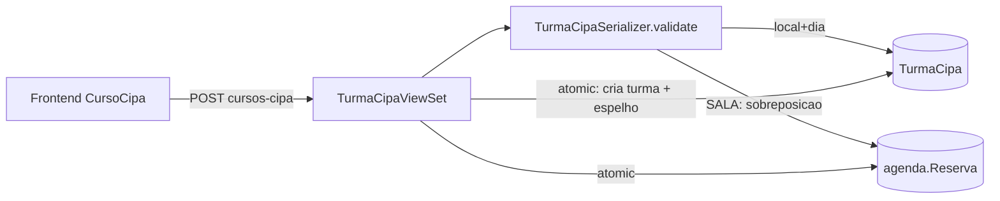

# Design — Agendamento de cursos CIPA (Condomed)

> **Rastreabilidade** — RF: RF-CIP-001..004 · INV: INV-CIP-001..003 · ADR: ADR-0001, ADR-0003..0006 · Questões: PA-001..002, PA-006
> **Status:** em revisão · **Dono:** Ingrid Aylana · **Atualizado:** 2026-09-04
> **Baseado em:** `requirements.md` (aprovado)

## Visão Geral da Solução

App Django `condomed` com `TurmaCipa` (local, data, horário, situação, observação) e `InscricaoCipa` (participante **com o próprio vínculo**: administradora e condomínio — ADR-0004); conflito validado no servidor por local+dia (RF-CIP-001) e, para a sala de reunião, também contra `agenda.Reserva` (RF-CIP-002), com espelho atômico conforme ADR-0001. Permissão `IsCondomedOrAdmin` (RF-CIP-004) com novo nível `condomed`. Frontend em spec própria (`FedConnect-FrontEnd-Prod/specs/curso-cipa/`).

## Arquitetura

| Arquivo/App | Mudança |
|---|---|
| `condomed/models.py` | `TurmaCipa` **perde** `administradora_codigo`, `administradora_nome` e `condominio_nome`; `InscricaoCipa` **ganha** os três (obrigatórios). `__str__` da turma passa a local + data |
| `condomed/migrations/0002_vinculo_no_inscrito.py` (novo) | remove os três campos da turma e cria os três na inscrição. **Destrutiva e sem cópia de dados** — não há turma em produção (PA-006) |
| `condomed/serializers.py` | `InscricaoCipaSerializer` valida administradora e condomínio; `TurmaCipaSerializer` deixa de aceitá-los e passa a expor `administradoras` e `condominios` derivados |
| `condomed/services.py` | tema do espelho na agenda vira `"Curso CIPA — <local>"` (não há condomínio da turma) |
| `condomed/views.py` | `verificar-cpf` devolve administradora e condomínio de cada inscrição; conflito 409 deixa de citar o condomínio da turma |
| `condomed/serializers.py` — `ImportarTurmaSerializer` (novo, ADR-0005) | valida turma + lista em bloco: capacidade, regras de linha e CPF repetido dentro da própria planilha; `criar()` grava tudo |
| `condomed/views.py` — `importar` e `planilha-modelo` (novos, ADR-0005) | `POST cursos-cipa/importar/` (uma transação) e `GET cursos-cipa/planilha-modelo/` (xlsx via openpyxl, padrão do app `planilha`) |
| `users/models.py`, migração | novo choice `condomed` em `nivel_acesso` |
| `users/permissions.py` | `IsCondomedOrAdmin` |
| `bigcorp/urls.py`, `bigcorp/settings.py` | `router.register('cursos-cipa', ...)`; app em `INSTALLED_APPS` |
| `agenda/*` | **intocado** (o espelho usa o model existente) |

## Modelo de Dados e Contratos

- `TurmaCipa`: `local` (choices `AUDITORIO`, `SALA_REUNIAO`), `data` (DateField), `hora_inicio`/`hora_fim` (TimeField, defaults 09:00/17:30), `observacao`, `status` (choices `agendada`/`realizada`/`cancelada`), `criado_por` (FK), `reserva_sala` (OneToOne `agenda.Reserva`, nullable, `on_delete=SET_NULL`), `criado_em`. Índice `(local, data)`. **Sem cliente** (ADR-0004).
- `InscricaoCipa`: FK `turma`, `nome`, `cpf` (11 dígitos), `funcao`, `email`, `telefone`, `administradora_codigo` + `administradora_nome` (do Firebird via FedHub, nome desnormalizado), `condominio_nome` (digitado — não há código de condomínio), `criado_em`; `unique_together (turma, cpf)`. Índice `(administradora_codigo,)` para a consulta por administradora.
- `LOCAIS_CIPA`: `{AUDITORIO: {nome, predio, capacidade}, SALA_REUNIAO: {...}}` — capacidades: auditório 30, sala de reunião 10 (PA-001, fechada em 2026-08-31).
- Importação: `POST cursos-cipa/importar/` recebe `{local, data, observacao, inscricoes: [...]}` e devolve a turma criada; `GET cursos-cipa/planilha-modelo/` devolve o `.xlsx` modelo. Cabeçalhos do modelo em `COLUNAS_MODELO` (`condomed/views.py`) — é o contrato com o parser da tela.
- Contrato: `GET/POST cursos-cipa/?mes&ano&local` (sem paginação — o calendário pede o mês inteiro), `GET cursos-cipa/locais/`, `GET cursos-cipa/verificar-cpf/?cpf&excluir_turma` (onde mais o CPF está inscrito; a tela usa para avisar antes de gravar), `GET/PATCH/DELETE cursos-cipa/{id}/`, `GET/POST cursos-cipa/{id}/inscricoes/`, `PATCH/DELETE cursos-cipa/{id}/inscricoes/{iid}/` (o PATCH é parcial: o CPF não enviado é preservado, e a checagem de capacidade não se aplica à edição de quem já está na lista). Resposta da turma inclui `capacidade`, `total_inscritos`, `acima_da_capacidade` (quantos passam da capacidade; 0 quando dentro) e as listas derivadas `administradoras` (`[{codigo, nome}]`) e `condominios` (`[nome]`), sem repetição e somente-leitura — é o que permite rotular, filtrar e buscar o mês sem baixar todos os inscritos (ADR-0004). Erros: 409 `{"detail", "conflito": {...}}`; 400 DRF padrão.

## Invariantes

| ID | Invariante | Garantido em |
|---|---|---|
| INV-CIP-001 | Duas turmas ativas nunca ocupam o mesmo local com intervalos sobrepostos no mesmo dia | aplicação (serializer) + banco (índice `(local, data)`; unicidade por dia pode virar constraint enquanto a hora for fixa) |
| INV-CIP-002 | Toda turma ativa com `local=SALA_REUNIAO` tem exatamente uma `agenda.Reserva` espelho no mesmo dia e intervalo | aplicação (`transaction.atomic()` em create/destroy) |
| INV-CIP-005 | Duas inscrições com o mesmo CPF nunca coexistem na mesma turma, mesmo em requisições simultâneas | banco (`unique_together (turma, cpf)`) + aplicação (validação do serializer e tradução da constraint em `views.salvar_inscricao`) |
| INV-CIP-003 | O excesso sobre a capacidade do local é sempre visível na resposta da turma (`acima_da_capacidade`) — a capacidade é referência, não limite (ADR-0006) | aplicação (serializer da turma) |
| INV-CIP-004 | Toda inscrição tem administradora e condomínio preenchidos | aplicação (serializer) + banco (campos não nulos, sem default) |

## Fluxo Principal

1. Operador (nível `condomed`) escolhe local e dia (RF-CIP-001).
2. Serializer valida conflito por local+dia; se sala, também contra `agenda.Reserva` (RF-CIP-002).
3. `perform_create` em `atomic`: grava turma; se sala, grava Reserva espelho (`tema="Curso CIPA — <condomínio>"`, `horario="09:00"`, `duracao=510`, `criado_por`=operador) e vincula (INV-CIP-002).
4. Operador inscreve funcionários; cada inscrição informa administradora e condomínio do participante e valida CPF, duplicidade, capacidade e o vínculo (RF-CIP-003, INV-CIP-003, INV-CIP-004).
5. Cancelar/excluir turma remove o espelho em `atomic`.

## Tratamento de Erros e Casos de Borda

| Falha | Comportamento | Requisito |
|---|---|---|
| Turma no mesmo local/dia | 409 com id/horário da turma conflitante | RF-CIP-001 |
| Reunião já marcada na sala no dia | 409 com horário da reserva | RF-CIP-002 |
| Falha ao gravar o espelho | rollback da turma (atomic) | RNF-CIP-002 |
| Reserva espelho excluída pela agenda atual | INV-CIP-002 violado: listagem marca turma como "sem espelho" e oferece recriar (ação admin) | RF-CIP-002 |
| Duas inscrições simultâneas na última vaga | ambas entram; a turma fica 1 acima e a resposta sinaliza | RF-CIP-003 |
| Duas inscrições simultâneas com o **mesmo CPF** | a validação deixa as duas passarem; o `unique_together` barra a segunda e `salvar_inscricao` devolve 400, não 500 | RF-CIP-003 |
| Usuário sem nível | 403 | RF-CIP-004 |

## Decisões

- ADR-0001: turma na sala espelhada como `agenda.Reserva`.
- ADR-0003: duplicidade de inscrito entre turmas avisa, não bloqueia.
- ADR-0004: administradora e condomínio são do inscrito, não da turma; a turma é identificada por local + ocupação.
- ADR-0005: importação por planilha cria turma e inscritos numa transação só, tudo-ou-nada, e a planilha não traz local nem data.
- ADR-0006: capacidade do local é referência, não limite; o excesso é sinalizado, e o `select_for_update` da inscrição sai porque existia só para essa trava.

## Divergência vs. produção

- A agenda atual não valida conflito no servidor (`agenda/serializers.py` sem `validate()`; `agenda/views.py` sem trava) — uma reunião criada por POST direto pode sobrepor uma turma já espelhada. Registrado como PA-004; o CIPA não depende dela para o próprio invariante, mas a direção reunião→curso só é forte com a correção.
- `agenda/serializers.py` expõe `criado_por_nome = instance.criado_por.username`, e `Usuario.username = None` (`users/models.py:51`) — a Reserva espelho herda esse campo vazio; sem efeito funcional.

## Estratégia de Testes

| CT | Requisito | Caso |
|---|---|---|
| CT-CIP-001 | RF-CIP-001 | Criar turma válida no auditório → 201 com defaults 09:00/17:30 |
| CT-CIP-002 | RF-CIP-001 | Segunda turma no mesmo local/dia → 409 |
| CT-CIP-003 | RF-CIP-002 | Turma na sala cria Reserva espelho vinculada; excluir turma remove a Reserva |
| CT-CIP-004 | RF-CIP-002 | Reserva existente na sala (ex: 10:00, 120 min) no dia → turma na sala 409 |
| CT-CIP-005 | RF-CIP-003 | Inscrição válida → 201; CPF repetido → 400; CPF inválido → 400 |
| CT-CIP-019 | RF-CIP-003 | CPF repetido na turma → 400 (com e sem máscara); corrida com a validação neutralizada → 400 e um único registro; editar mantendo o próprio CPF → 200; editar para o CPF de outro inscrito → 400; mesmo CPF em outra turma → 201 |
| CT-CIP-006 | RF-CIP-003 | Inscrição além da capacidade → 201 e `acima_da_capacidade` com o excesso; turma dentro da capacidade → 0 |
| CT-CIP-007 | RF-CIP-004 | Usuário `usuario` → 403; `condomed` e `admin` → 200 |
| CT-CIP-008 | RNF-CIP-002 | Falha forçada ao criar o espelho → nenhuma turma persistida |
| CT-CIP-009 | RF-CIP-003 | `verificar-cpf`: CPF em outra turma → 200 com turma, administradora e condomínio; `excluir_turma` remove a turma aberta; CPF inválido → 400 |
| CT-CIP-010 | RF-CIP-003 | Editar inscrito com a turma lotada → 200; o próprio CPF não conta como duplicidade |
| CT-CIP-011 | RF-CIP-003 | Inscrição sem administradora ou sem condomínio → 400 (INV-CIP-004) |
| CT-CIP-012 | RF-CIP-001 | Turma com inscritos de duas administradoras → resposta traz as duas em `administradoras`, sem repetição, e os dois condomínios |
| CT-CIP-013 | RF-CIP-001 | POST de turma com `administradora_codigo`/`condominio_nome` → campos ignorados (não existem mais no contrato da turma) |
| CT-CIP-014 | RF-CIP-002 | DELETE da turma: 204, inscrições apagadas em cascata, Reserva espelho removida, dia liberado; `usuario` → 403; cancelar preserva as inscrições e ainda libera a sala |
| CT-CIP-015 | RF-CIP-005 | `importar` com lista válida → 201 com a turma, os inscritos e os condomínios derivados |
| CT-CIP-016 | RF-CIP-005 | Linha com CPF inválido, sem vínculo ou com CPF repetido → 400 por índice e **nenhuma** turma criada |
| CT-CIP-017 | RF-CIP-005 | Lista maior que a capacidade → 201 com o excesso sinalizado; dia ocupado → 409; lista vazia → 400; na sala, cria o espelho |
| CT-CIP-018 | RF-CIP-005 | `planilha-modelo` devolve xlsx com os sete cabeçalhos e sem `local`/`data`; nível sem permissão → 403 nas duas rotas |

## Impacto e Riscos

Migração `0002` **destrutiva**: remove três colunas de `condomed_turmacipa` e cria três em `condomed_inscricaocipa`, sem cópia de dados — segura porque não há turma cadastrada (PA-006, confirmado com o dono em 2026-09-04). Reverter a migração recria as colunas vazias, não os valores. Contrato quebra para qualquer cliente que ainda envie administradora na turma: o deploy do backend e do frontend é o mesmo evento. Deploy coordenado com o frontend (menu/rota). Risco: Reserva espelho com `duracao=510` fora das durações da UI da agenda — verificar renderização (PA no repo do frontend).
