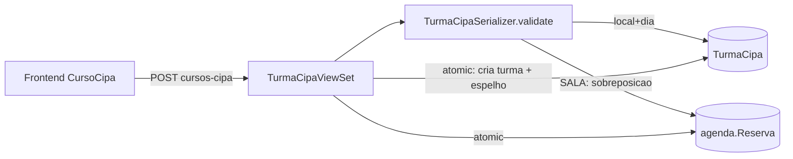

# Design — Agendamento de cursos CIPA (Condomed)

> **Rastreabilidade** — RF: RF-CIP-001..004 · INV: INV-CIP-001..003 · ADR: ADR-0001 · Questões: PA-001..002
> **Status:** aprovado · **Dono:** Ingrid Aylana · **Atualizado:** 2026-08-31
> **Baseado em:** `requirements.md` (aprovado)

## Visão Geral da Solução

App Django novo `condomed` com `TurmaCipa` e `InscricaoCipa`; conflito validado no servidor por local+dia (RF-CIP-001) e, para a sala de reunião, também contra `agenda.Reserva` (RF-CIP-002), com espelho atômico conforme ADR-0001. Permissão `IsCondomedOrAdmin` (RF-CIP-004) com novo nível `condomed`. Frontend em spec própria (`FedConnect-FrontEnd-Prod/specs/curso-cipa/`).

## Arquitetura

| Arquivo/App | Mudança |
|---|---|
| `condomed/models.py` (novo) | `TurmaCipa`, `InscricaoCipa`, constante `LOCAIS_CIPA` |
| `condomed/serializers.py` (novo) | validações de conflito, capacidade, CPF |
| `condomed/views.py` (novo) | `TurmaCipaViewSet` + rota aninhada de inscrições; `transaction.atomic()` |
| `users/models.py`, migração | novo choice `condomed` em `nivel_acesso` |
| `users/permissions.py` | `IsCondomedOrAdmin` |
| `bigcorp/urls.py`, `bigcorp/settings.py` | `router.register('cursos-cipa', ...)`; app em `INSTALLED_APPS` |
| `agenda/*` | **intocado** (o espelho usa o model existente) |

## Modelo de Dados e Contratos

- `TurmaCipa`: `local` (choices `AUDITORIO`, `SALA_REUNIAO`), `data` (DateField), `hora_inicio`/`hora_fim` (TimeField, defaults 09:00/17:30), `administradora_codigo` + `administradora_nome` (do Firebird via FedHub, nome desnormalizado), `condominio_nome` (digitado — não há código de condomínio; ajuste do dono em 2026-08-31), `observacao`, `status` (choices `agendada`/`realizada`/`cancelada`), `criado_por` (FK), `reserva_sala` (OneToOne `agenda.Reserva`, nullable, `on_delete=SET_NULL`), `criado_em`. Índice `(local, data)`.
- `InscricaoCipa`: FK `turma`, `nome`, `cpf` (11 dígitos), `funcao`, `email`, `telefone`, `criado_em`; `unique_together (turma, cpf)`.
- `LOCAIS_CIPA`: `{AUDITORIO: {nome, predio, capacidade}, SALA_REUNIAO: {...}}` — capacidades: auditório 30, sala de reunião 10 (PA-001, fechada em 2026-08-31).
- Contrato: `GET/POST cursos-cipa/?mes&ano&local` (sem paginação — o calendário pede o mês inteiro), `GET cursos-cipa/locais/`, `GET cursos-cipa/verificar-cpf/?cpf&excluir_turma` (onde mais o CPF está inscrito; a tela usa para avisar antes de gravar), `GET/PATCH/DELETE cursos-cipa/{id}/`, `GET/POST cursos-cipa/{id}/inscricoes/`, `PATCH/DELETE cursos-cipa/{id}/inscricoes/{iid}/` (o PATCH é parcial: o CPF não enviado é preservado, e a checagem de capacidade não se aplica à edição de quem já está na lista). Resposta da turma inclui `capacidade` e `total_inscritos`. Erros: 409 `{"detail", "conflito": {...}}`; 400 DRF padrão.

## Invariantes

| ID | Invariante | Garantido em |
|---|---|---|
| INV-CIP-001 | Duas turmas ativas nunca ocupam o mesmo local com intervalos sobrepostos no mesmo dia | aplicação (serializer) + banco (índice `(local, data)`; unicidade por dia pode virar constraint enquanto a hora for fixa) |
| INV-CIP-002 | Toda turma ativa com `local=SALA_REUNIAO` tem exatamente uma `agenda.Reserva` espelho no mesmo dia e intervalo | aplicação (`transaction.atomic()` em create/destroy) |
| INV-CIP-003 | O número de inscritos de uma turma nunca excede a capacidade do local | aplicação (serializer de inscrição, com `select_for_update` na turma) |

## Fluxo Principal

1. Operador (nível `condomed`) escolhe local, dia, administradora → condomínio, técnico (RF-CIP-001).
2. Serializer valida conflito por local+dia; se sala, também contra `agenda.Reserva` (RF-CIP-002).
3. `perform_create` em `atomic`: grava turma; se sala, grava Reserva espelho (`tema="Curso CIPA — <condomínio>"`, `horario="09:00"`, `duracao=510`, `criado_por`=operador) e vincula (INV-CIP-002).
4. Operador inscreve funcionários; cada inscrição valida CPF, duplicidade e capacidade (RF-CIP-003, INV-CIP-003).
5. Cancelar/excluir turma remove o espelho em `atomic`.

## Tratamento de Erros e Casos de Borda

| Falha | Comportamento | Requisito |
|---|---|---|
| Turma no mesmo local/dia | 409 com id/horário da turma conflitante | RF-CIP-001 |
| Reunião já marcada na sala no dia | 409 com horário da reserva | RF-CIP-002 |
| Falha ao gravar o espelho | rollback da turma (atomic) | RNF-CIP-002 |
| Reserva espelho excluída pela agenda atual | INV-CIP-002 violado: listagem marca turma como "sem espelho" e oferece recriar (ação admin) | RF-CIP-002 |
| Duas inscrições simultâneas na última vaga | `select_for_update` na turma; a segunda recebe 400 | RF-CIP-003 |
| Usuário sem nível | 403 | RF-CIP-004 |

## Decisões

- ADR-0001: turma na sala espelhada como `agenda.Reserva`.

## Divergência vs. produção

- A agenda atual não valida conflito no servidor (`agenda/serializers.py` sem `validate()`; `agenda/views.py` sem trava) — uma reunião criada por POST direto pode sobrepor uma turma já espelhada. Registrado como PA-004; o CIPA não depende dela para o próprio invariante, mas a direção reunião→curso só é forte com a correção.
- `agenda/serializers.py` expõe `criado_por_nome = instance.criado_por.username`, e `Usuario.username = None` (`users/models.py:51`) — a Reserva espelho herda esse campo vazio; sem efeito funcional.

## Estratégia de Testes

| CT | Requisito | Caso |
|---|---|---|
| CT-CIP-001 | RF-CIP-001 | Criar turma válida no auditório → 201 com defaults 09:00/17:30 |
| CT-CIP-002 | RF-CIP-001 | Segunda turma no mesmo local/dia → 409 |
| CT-CIP-003 | RF-CIP-002 | Turma na sala cria Reserva espelho vinculada; excluir turma remove a Reserva |
| CT-CIP-004 | RF-CIP-002 | Reserva existente na sala (ex: 10:00, 120 min) no dia → turma na sala 409 |
| CT-CIP-005 | RF-CIP-003 | Inscrição válida → 201; CPF repetido → 400; CPF inválido → 400 |
| CT-CIP-006 | RF-CIP-003 | Inscrição além da capacidade → 400 |
| CT-CIP-007 | RF-CIP-004 | Usuário `usuario` → 403; `condomed` e `admin` → 200 |
| CT-CIP-008 | RNF-CIP-002 | Falha forçada ao criar o espelho → nenhuma turma persistida |

## Impacto e Riscos

Migrações novas (app `condomed`, choice `condomed` em `users`) — sem alteração de tabelas existentes; rollback = reverter migrações. Deploy coordenado com o frontend (menu/rota). Risco: Reserva espelho com `duracao=510` fora das durações da UI da agenda — verificar renderização (PA no repo do frontend).
