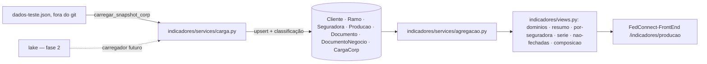

# Design — Indicadores executivos da produção (espelho da CORP e agregações)

> **Rastreabilidade** — RF: RF-IEX-001..007 · INV: INV-IEX-001..006 · ADR: ADR-0009 · Questões: PA-019, PA-020, PA-021, PA-022
> **Status:** em revisão · **Dono:** Hamilton (gestor comercial), via Lucas Guidi · **Atualizado:** 2026-09-22
> **Baseado em:** `requirements.md` (aprovado em 2026-09-22 pelo dono, por mensagem: "por enquanto vai ser o CORP, para a usuária mexer e ver, depois de um tempo vamos fazer com o lake")

## Visão Geral da Solução

Um app Django novo, `indicadores`, guarda no Postgres um espelho normalizado das tabelas da CORP que o painel usa e calcula a classificação de renovação **na carga**, não na leitura (ADR-0009). Os endpoints de RF-IEX-002..007 só filtram e agregam com o ORM, um por seção do painel, e devolvem números prontos com a cobertura de valor ao lado de cada soma (RF-IEX-003, PA-019). O carregador da v1 lê o snapshot da CORP de um arquivo local (RF-IEX-001); a fase 2 troca só o carregador pelo lake (RNF-IEX-004, PA-021).

## Arquitetura



| Arquivo/App | Mudança |
|---|---|
| `indicadores/` (novo) | `apps.py`, `models.py`, `admin.py`, `serializers.py`, `views.py`, `services/periodos.py`, `services/carga.py`, `services/agregacao.py`, `services/nao_fechadas.py`, `management/commands/carregar_snapshot_corp.py`, `migrations/0001_espelho_corp.py`, `tests.py` |
| `bigcorp/settings.py` | `"indicadores"` em `INSTALLED_APPS`, com comentário citando esta spec |
| `bigcorp/urls.py` | seis rotas sob `indicadores/` (tabela abaixo), agrupadas com comentário `# INDICADORES EXECUTIVOS` |
| `users/permissions.py` | nenhuma mudança: `IsAuthenticated` (PA-018) |

Nenhuma view duplicada entre `consultas/` e `fedhub/` é tocada. Nada passa pelo FedHub.

## Modelo de Dados e Contratos

### Modelos (todos em `indicadores/models.py`)

| Modelo | Chave | Campos | Origem CORP |
|---|---|---|---|
| `Cliente` | `codigo` (int, PK) | `cpf_cnpj` (str 20, blank), `pessoa` (`F`/`J`, blank), `nome` (str 200, blank) | `/clientes` |
| `Ramo` | `abreviatura` (str 10, PK) | `nome` | `/ramos` |
| `Seguradora` | `sigla` (str 10, PK) | `nome` | `/seguradoras` |
| `Producao` | `nosnum` (int, PK); `codfil` (int, null) — PA-020 | `tipdoc` (str 2), `seguradora` FK null, `ramo` FK null, `cliente` FK null, `cliente_nome` (str 200), `inivig`/`fimvig`/`datemi` (date null), `datemi_bruta` (str 20, blank — guarda o texto inválido), `nosnum_ren` (int null), `cancelado` (bool), `renovacao_situacao` (int null), `sin_situacao` (int null), **`renovacao`** (bool, derivado), `carga` FK | `/producao` |
| `Documento` | `producao` (OneToOne, PK) | `pretot`, `val_c`, `preliq` (`DecimalField(14,2)`, null), `fonte` (`D` documento / `R` feed de renovações) | `/documento` |
| `DocumentoNegocio` | `producao` (OneToOne, PK) | `codigo_negocio` (str 30), `datinc_negocio` (date null) | `acompanhamento.negocio` |
| `CargaCorp` | id | `origem` (`snapshot`/`lake`), `arquivo` (str), `gerado_em` (str), `extraido_em` (date), `iniciada_em`, `concluida_em`, `sucesso` (bool), `erro` (texto — motivo quando o contrato quebrou), `contagens` (JSON), `rejeitos` (JSON), `duracao_ms` | — |

Índices: `Producao(datemi)`, `Producao(fimvig)`, `Producao(seguradora, datemi)`, `Producao(cliente, inivig)`, `Producao(nosnum_ren)`.

Nomes de campo são os da CORP (RNF-IEX-002). Migração cria só tabelas novas; nada altera tabelas existentes.

### Parâmetros comuns (todos os endpoints, query string)

| Parâmetro | Valores | Padrão |
|---|---|---|
| `periodo` | `hoje` · `semana` · `mes` · `ano` · `faixa` | `mes` |
| `data_referencia` | `AAAA-MM-DD` | hoje em `America/Sao_Paulo` |
| `data_ini`, `data_fim` | `AAAA-MM-DD` (só com `faixa`; invertidos são trocados) | — |
| `ramo` | repetível (`?ramo=COND&ramo=FIAN`) | todos |
| `seguradora` | repetível | todas |
| `incluir_cancelados` | `true`/`false` | `false` |
| `todos_tipdoc` | `true`/`false` (`false` = só `A`) | `false` |
| `janela_dias` | inteiro 0..180 | `30` |

Parâmetro inválido → 400 `{"sucesso": false, "erro": "..."}`.

### Bloco de indicadores (reusado em todas as respostas)

```json
{"fechados": 385, "renovacoes": 262, "captacoes": 123, "com_negocio_origem": 4,
 "valor_fechado": "123456.78", "documentos_com_valor": 12,
 "comissao": null, "documentos_com_comissao": 0}
```

`valor_fechado`/`comissao` são string decimal ou `null` quando `documentos_com_*` é zero. Nunca `"0.00"` por ausência.

### Respostas

`GET indicadores/dominios/`
```json
{"sucesso": true, "extraido_em": "2026-09-22", "gerado_em": "2026-09-22 12:57",
 "total_documentos": 25760, "documentos_sem_datemi": 2037, "dados_parciais": false,
 "carga": {"origem": "snapshot", "concluida_em": "...", "rejeitos": {"cliente_desconhecido": 0}},
 "ramos": [{"sigla": "COND", "nome": "CONDOMINIO", "total_base": 10475, "fechados_periodo": 180}],
 "seguradoras": [{"sigla": "ALLI", "nome": "ALLIANZ SEGUROS", "total_base": 4955, "fechados_periodo": 90}]}
```
Listas ordenadas por `total_base` decrescente, depois sigla (ordem fixa, para o chip não mudar de lugar): `total_base` conta a base inteira, sem filtro nem toggle. `fechados_periodo` aplica o universo e o filtro cruzado: o contador de ramo respeita as seguradoras escolhidas e vice-versa (RF-IEX-002). `carga` é a última carga com `sucesso`; sem nenhuma, `carga`, `extraido_em` e `gerado_em` vêm `null`.

`GET indicadores/resumo/`
```json
{"sucesso": true,
 "filtros": {"periodo": "mes", "data_referencia": "2026-09-22", "periodo_ini": "2026-09-01", "periodo_fim": "2026-09-22",
             "anterior_ini": "2026-08-01", "anterior_fim": "2026-08-22", "ramos": [], "seguradoras": []},
 "dados_parciais": false,
 "atual": {Bloco}, "anterior": {Bloco},
 "periodos": {"hoje": {Bloco}, "semana": {Bloco}, "mes": {Bloco}, "ano": {Bloco}}}
```
Períodos: hoje `[ref, ref]`; semana `[segunda-feira da ref, ref]`; mês `[dia 1, ref]`; ano `[1º jan, ref]`; faixa `[data_ini, data_fim]`. Anteriores: dia anterior; `[segunda−7, ref−7]`; mesmo trecho do mês anterior (dia limitado ao último do mês); mesmo trecho do ano anterior; intervalo imediatamente anterior de mesma duração. `dados_parciais` é `true` quando `data_referencia > extraido_em`.

`GET indicadores/por-seguradora/`
```json
{"sucesso": true, "linhas": [{"seguradora": "ALLI", "nome": "ALLIANZ SEGUROS", ...Bloco, "nao_fechadas": 3}],
 "total": {...Bloco, "nao_fechadas": 17}}
```
Só seguradoras com `fechados > 0` ou `nao_fechadas > 0`; ordem por `fechados` decrescente, depois `nao_fechadas`. `nao_fechadas` é a de RF-IEX-006 (vencidas decididas sem nova apólice), independente do período.

`GET indicadores/serie/?tipo=dia|mes`
```json
{"sucesso": true, "tipo": "mes", "ano": 2026,
 "pontos": [{"periodo": "2026-01", "rotulo": "jan", "futuro": false, ...Bloco}]}
```
`dia`: 30 pontos, `periodo` `AAAA-MM-DD`, `rotulo` `DD/MM`, do `ref−29` ao `ref`. `mes`: 12 pontos do ano da referência; meses após a referência vêm zerados com `futuro: true`; o mês corrente vai até a referência.

`GET indicadores/nao-fechadas/`
```json
{"sucesso": true, "mes": "2026-09", "janela_dias": 30,
 "resumo": {"vencem_no_mes": 640, "vencidas": 420, "vencidas_decididas": 300, "vencidas_ainda_vigentes": 120,
            "vencidas_sem_nova_apolice": 41, "a_vencer": 220,
            "corp_diz": [{"situacao": 2, "rotulo": "renovada", "quantidade": 200}]},
 "vencidas": {"total": 300, "exibidas": 300, "linhas": [Linha]},
 "a_vencer": {"total": 220, "exibidas": 220, "linhas": [Linha]}}
```
`Linha`: `{"nosnum", "fimvig", "datemi", "cliente", "cpf_cnpj", "pessoa", "seguradora", "seguradora_nome", "ramo", "renovacao_situacao", "renovacao_situacao_rotulo", "sin_situacao", "fechada", "novas_apolices": [{"nosnum", "seguradora", "seguradora_nome"}]}`. `cpf_cnpj` já mascarado (PA-022): CPF `***.456.789-**`, CNPJ formatado completo. Ordem: não fechadas primeiro, depois `fimvig` crescente. Corte em 400 por lista (`exibidas < total` quando cortou). Rótulos: 1 vigente, 2 renovada, 3 não renovada, 5 "5 (sem legenda)", 6 cancelada, −1 "—".

`GET indicadores/composicao/`
```json
{"sucesso": true,
 "captacoes": {"total": 123, "exibidas": 123, "linhas": [{"nosnum", "cliente", "seguradora", "seguradora_nome", "ramo", "data"}]},
 "renovacoes": {"total": 262, "exibidas": 262, "linhas": [...]},
 "vencidas_sem_nova_apolice": {"total": 41, "exibidas": 41, "linhas": [...]}}
```
`data` = `datemi` nas duas primeiras, `fimvig` na terceira. Emitidas em ordem de `datemi` decrescente e cliente; vencidas por `fimvig` decrescente. Corte em 400.

## Invariantes

| ID | Invariante | Garantido em |
|---|---|---|
| INV-IEX-001 | `fechados = renovacoes + captacoes` em todo Bloco | aplicação (a classificação é um booleano por linha; o teste CT-IEX-004 verifica) |
| INV-IEX-002 | Não existe duas linhas de `Producao` com o mesmo `nosnum`, nem dois `Documento` para a mesma produção | banco (PK / OneToOne) |
| INV-IEX-003 | `valor_fechado` é `null` se e só se `documentos_com_valor = 0`; idem comissão | aplicação (`agregacao.py` monta o Bloco) |
| INV-IEX-004 | Toda `Producao` aponta para a `CargaCorp` que a gravou por último | aplicação (upsert grava `carga`) |
| INV-IEX-005 | A quantidade das listas de composição é igual ao número do cartão para os mesmos filtros | aplicação (as duas saem da mesma queryset filtrada; CT-IEX-007) |
| INV-IEX-006 | Nenhuma resposta contém CPF com os 11 dígitos | aplicação (`mascarar()` é o único caminho de saída de `cpf_cnpj`; CT-IEX-008) |

## Fluxo Principal

1. Operador roda `python manage.py carregar_snapshot_corp <arquivo>`. O comando abre uma `CargaCorp`, lê o JSON e valida o contrato (`colunas`, `docs`, mapas).
2. `carga.py` faz `bulk_create(..., update_conflicts=True)` em Cliente, Ramo, Seguradora; depois Producao (convertendo datas, guardando texto inválido em `datemi_bruta`, resolvendo FKs e contando rejeitos); depois Documento e DocumentoNegocio. Tudo em `transaction.atomic()`.
3. `carga.py` calcula `renovacao`: para cada CPF/CNPJ, a "primeira apólice" é o menor `(inivig, nosnum)` entre as produções `tipdoc = 'A'` com `inivig`; uma produção é renovação se `nosnum_ren > 0` ou se a primeira do seu CPF/CNPJ não é ela mesma e tem `(inivig, nosnum)` menor. Grava em lote.
4. Fecha a `CargaCorp` com contagens, rejeitos e duração.
5. A tela chama os seis endpoints em paralelo com os mesmos filtros. `periodos.py` resolve as janelas; `agregacao.py` monta a queryset base (`tipdoc`, `cancelado`, ramos, seguradoras) e agrega com `Count`, `Sum`, `Case/When`, `TruncDay`/`TruncMonth` com `tzinfo` de `America/Sao_Paulo`; `nao_fechadas.py` resolve a regra da janela.

## Tratamento de Erros e Casos de Borda

| Falha | Comportamento | Requisito |
|---|---|---|
| Arquivo do snapshot inexistente ou fora do contrato | `CommandError` com a chave que faltou; `CargaCorp` gravada como falha | RF-IEX-001 |
| Documento cita cliente/ramo/seguradora desconhecido | FK nula; rejeito contado por tipo | RF-IEX-001 |
| Data inválida (`15/08/205`, `2052-11-13` fica válida porém futura) | inválida → `null` + `datemi_bruta`; futura → gravada como está e fica fora dos períodos | RF-IEX-001 |
| Mesmo snapshot duas vezes | upsert; contagens iguais; nenhuma duplicata | RF-IEX-001 |
| Base vazia (nenhuma carga) | 200 com Blocos zerados e `extraido_em: null`; a tela avisa | RF-IEX-002 |
| `periodo=faixa` sem `data_ini`/`data_fim` | 400 | RF-IEX-003 |
| `data_referencia` posterior à extração | 200 com `dados_parciais: true` | RF-IEX-003 |
| Sem JWT | 401 padrão do DRF | RNF-IEX-001 |
| Listas acima de 400 linhas | corte com `exibidas < total` | RF-IEX-006, RF-IEX-007 |

## Decisões

- ADR-0009: espelho da CORP no Postgres do FedConnect, classificação de renovação persistida na carga e indicadores agregados no Django.

## Divergência vs. produção

- Primeira agregação com o ORM no repositório: os `analytics/` existentes (`fedhub/views/analytics_view.py`) são proxy ao FedHub e continuam intocados. Não há duplicata em `consultas/` a sincronizar.
- Primeiro modelo do repositório cuja fonte é um arquivo carregado por comando, não uma tela ou o FedHub. O arquivo com dado real não é versionado.
- Em produção o banco é Postgres; em desenvolvimento local, o comando e os testes rodam em SQLite (settings fora do repo). `TruncDay/TruncMonth` e `Sum` de `DecimalField` funcionam nos dois; o teste CT-IEX-005 cobre o corte de dia em fuso local.

## Estratégia de Testes

Dados sintéticos gerados em `tests.py` (CPF/CNPJ fictícios evidentes, nomes "Cliente N"), nunca o snapshot real.

| CT | Requisito | Caso |
|---|---|---|
| CT-IEX-001 | RF-IEX-001, RNF-IEX-004 | carga de snapshot sintético: contagens por tabela, rejeito de cliente desconhecido, data inválida nula com `datemi_bruta`, `CargaCorp` com origem `snapshot`; segunda carga não duplica |
| CT-IEX-002 | RF-IEX-001 | renovação: `nosnum_ren > 0`; mesmo CPF com apólice anterior em outro ramo/seguradora; apólice anterior cancelada ainda conta; empate de `inivig` resolvido por `nosnum`; cliente sem documento só pela cadeia; primeira apólice do CPF é captação |
| CT-IEX-003 | RF-IEX-002, RF-IEX-003, RNF-IEX-002, RNF-IEX-003 | resumo: universo padrão exclui `tipdoc X` e cancelados; toggles incluem; semana começa na segunda; mês/ano até a referência; período anterior equivalente; `valor_fechado` `null` sem valor e string decimal com valor; `dados_parciais`; domínios com contadores cruzados |
| CT-IEX-004 | RF-IEX-004, RNF-IEX-002 | por seguradora: soma das linhas = total; `fechados = renovacoes + captacoes` em cada linha; ordem |
| CT-IEX-005 | RF-IEX-005 | série: 30 pontos de dia com o último = referência; 12 meses com futuros marcados; emissão às 23h30 local cai no dia local |
| CT-IEX-006 | RF-IEX-006 | não fechadas: vencida com `nosnum_ren` apontando → fechada; mesmo CPF com `inivig` dentro da janela em outro ramo → fechada; fora da janela → não fechada; `renovacao_situacao = 1` fica fora das vencidas decididas; a vencer separado; CPF mascarado; corte em 400 |
| CT-IEX-007 | RF-IEX-007 | composição: `total` de cada lista igual ao Bloco do resumo e ao `vencidas_sem_nova_apolice` |
| CT-IEX-008 | RNF-IEX-001 | sem JWT → 401; `usuario` comum → 200; nenhuma resposta com 11 dígitos consecutivos de CPF |

## Impacto e Riscos

- Migração cria sete tabelas novas; nada altera tabelas existentes. Rollback: `migrate indicadores zero`. Deploy do Django antes do front.
- Em produção a carga precisa de alguém rodar o comando com o arquivo até a fase 2 (PA-021). Sem carga, a tela avisa "sem dados" e não quebra.
- Dado pessoal: o snapshot fica fora do git; CPF sai mascarado; acesso é para qualquer autenticado por decisão do dono (PA-018, PA-022). Se a decisão mudar, a classe de permissão entra em `users/permissions.py` sem mexer nas views além de uma linha.
- Volume atual (25.760) é pequeno; a classificação de renovação em Python na carga é O(n) com um dicionário por CPF. Se o lake trouxer milhões, a classificação vira SQL com window function (fica registrado no ADR-0009 como caminho).
