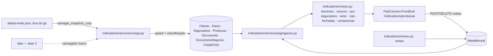

# Design — Indicadores executivos da produção (espelho da CORP e agregações)

> **Rastreabilidade** — RF: RF-IEX-001..008 · INV: INV-IEX-001..008 · ADR: ADR-0009 · Questões: PA-019, PA-020, PA-021, PA-022, PA-023
> **Status:** em revisão · **Dono:** Hamilton (gestor comercial), via Lucas Guidi · **Atualizado:** 2026-09-23
> **Baseado em:** `requirements.md` (aprovado em 2026-09-22 pelo dono, por mensagem: "por enquanto vai ser o CORP, para a usuária mexer e ver, depois de um tempo vamos fazer com o lake")

## Visão Geral da Solução

Um app Django novo, `indicadores`, guarda no Postgres um espelho normalizado das tabelas da CORP que o painel usa e calcula a classificação de renovação **na carga**, não na leitura (ADR-0009). Os endpoints de RF-IEX-002..007 só filtram e agregam com o ORM, um por seção do painel, e devolvem números prontos com a cobertura de valor ao lado de cada soma (RF-IEX-003, PA-019). O carregador da v1 lê o snapshot da CORP de um arquivo local (RF-IEX-001); a fase 2 troca só o carregador pelo lake (RNF-IEX-004, PA-021). A única tabela que não é espelho é `MetaMensal` (RF-IEX-008, PA-023): meta em R$ por seguradora × ramo × mês, cadastrada pela tela e comparada com o valor fechado do mês.

## Arquitetura



| Arquivo/App | Mudança |
|---|---|
| `indicadores/` (novo) | `apps.py`, `models.py`, `admin.py`, `serializers.py`, `views.py`, `services/periodos.py`, `services/carga.py`, `services/agregacao.py`, `services/nao_fechadas.py`, `services/metas.py`, `management/commands/carregar_snapshot_corp.py`, `migrations/0001_espelho_corp.py`, `migrations/0002_meta_mensal.py`, `tests.py`, `test_metas.py` |
| `bigcorp/settings.py` | `"indicadores"` em `INSTALLED_APPS`, com comentário citando esta spec |
| `bigcorp/urls.py` | oito rotas sob `indicadores/` (seis leituras e duas de metas), agrupadas com comentário `# INDICADORES EXECUTIVOS` |
| `users/permissions.py` | nenhuma mudança: `IsAuthenticated` (PA-018) |

Nenhuma view duplicada entre `consultas/` e `fedhub/` é tocada. Nada passa pelo FedHub.

## Modelo de Dados e Contratos

### Modelos (todos em `indicadores/models.py`)

| Modelo | Chave | Campos | Origem CORP |
|---|---|---|---|
| `Cliente` | `codigo` (int, PK) | `cpf_cnpj` (str 20, blank), `pessoa` (`F`/`J`, blank), `nome` (str 200, blank) | `/clientes` |
| `Ramo` | `abreviatura` (str 10, PK) | `nome` | `/ramos` |
| `Seguradora` | `sigla` (str 10, PK) | `nome` | `/seguradoras` |
| `Producao` | `nosnum` (int, PK); `codfil` (int, null) — PA-020 | `tipdoc` (str 2), `seguradora` FK null, `ramo` FK null, `cliente` FK null, `cliente_nome` (str 200), `inivig`/`fimvig`/`datemi` (date null), `datemi_bruta` (str 20, blank — guarda o texto inválido), `nosnum_ren` (int null), `cancelado` (bool), `renovacao_situacao` (int null), `sin_situacao` (int null), **`renovacao`** (bool, derivado), `carga` FK | `/producao` |
| `Documento` | `producao` (OneToOne, PK) | `pretot`, `val_c`, `preliq` (`DecimalField(14,2)`, null), `fonte` (`D` documento / `R` feed de renovações) | `/documento` |
| `DocumentoNegocio` | `producao` (OneToOne, PK) | `codigo_negocio` (str 30), `datinc_negocio` (date null) | `acompanhamento.negocio` |
| `CargaCorp` | id | `origem` (`snapshot`/`lake`), `arquivo` (str), `gerado_em` (str), `extraido_em` (date), `iniciada_em`, `concluida_em`, `sucesso` (bool), `erro` (texto — motivo quando o contrato quebrou), `contagens` (JSON), `rejeitos` (JSON), `duracao_ms` | — |
| `MetaMensal` (RF-IEX-008) | id; única em (`seguradora`, `ramo`, `competencia`) — INV-IEX-007 | `seguradora` FK `PROTECT`, `ramo` FK `PROTECT`, `competencia` (date, sempre dia 1), `valor_meta` (`DecimalField(14,2)`, > 0), `criado_por`/`atualizado_por` FK usuário null `SET_NULL`, `criado_em`, `atualizado_em` | — (cadastro na tela, PA-023) |

Índices: `Producao(datemi)`, `Producao(fimvig)`, `Producao(seguradora, datemi)`, `Producao(cliente, inivig)`, `Producao(nosnum_ren)`, `MetaMensal(competencia)`.

Nomes de campo são os da CORP (RNF-IEX-002). As migrações (`0001_espelho_corp`, `0002_meta_mensal`) criam só tabelas novas; nada altera tabelas existentes.

### Parâmetros comuns (todos os endpoints, query string)

| Parâmetro | Valores | Padrão |
|---|---|---|
| `periodo` | `hoje` · `semana` · `mes` · `ano` · `faixa` | `mes` |
| `data_referencia` | `AAAA-MM-DD` | hoje em `America/Sao_Paulo` |
| `data_ini`, `data_fim` | `AAAA-MM-DD` (só com `faixa`; invertidos são trocados) | — |
| `ramo` | repetível (`?ramo=COND&ramo=FIAN`) | todos |
| `seguradora` | repetível | todas |
| `incluir_cancelados` | `true`/`false` | `false` |
| `todos_tipdoc` | `true`/`false` (`false` = só `A`) | `false` |
| `janela_dias` | inteiro 0..180 | `30` |

Parâmetro inválido → 400 `{"sucesso": false, "erro": "..."}`.

### Bloco de indicadores (reusado em todas as respostas)

```json
{"fechados": 385, "renovacoes": 262, "captacoes": 123, "com_negocio_origem": 4,
 "valor_fechado": "123456.78", "documentos_com_valor": 12,
 "comissao": null, "documentos_com_comissao": 0}
```

`valor_fechado`/`comissao` são string decimal ou `null` quando `documentos_com_*` é zero. Nunca `"0.00"` por ausência.

### Respostas

`GET indicadores/dominios/`
```json
{"sucesso": true, "extraido_em": "2026-09-22", "gerado_em": "2026-09-22 12:57",
 "total_documentos": 25760, "documentos_sem_datemi": 2037, "dados_parciais": false,
 "carga": {"origem": "snapshot", "concluida_em": "...", "rejeitos": {"cliente_desconhecido": 0}},
 "ramos": [{"sigla": "COND", "nome": "CONDOMINIO", "total_base": 10475, "fechados_periodo": 180}],
 "seguradoras": [{"sigla": "ALLI", "nome": "ALLIANZ SEGUROS", "total_base": 4955, "fechados_periodo": 90}]}
```
Listas ordenadas por `total_base` decrescente, depois sigla (ordem fixa, para o chip não mudar de lugar): `total_base` conta a base inteira, sem filtro nem toggle. `fechados_periodo` aplica o universo e o filtro cruzado: o contador de ramo respeita as seguradoras escolhidas e vice-versa (RF-IEX-002). `carga` é a última carga com `sucesso`; sem nenhuma, `carga`, `extraido_em` e `gerado_em` vêm `null`.

`GET indicadores/resumo/`
```json
{"sucesso": true,
 "filtros": {"periodo": "mes", "data_referencia": "2026-09-22", "periodo_ini": "2026-09-01", "periodo_fim": "2026-09-22",
             "anterior_ini": "2026-08-01", "anterior_fim": "2026-08-22", "ramos": [], "seguradoras": []},
 "dados_parciais": false,
 "atual": {Bloco}, "anterior": {Bloco},
 "periodos": {"hoje": {Bloco}, "semana": {Bloco}, "mes": {Bloco}, "ano": {Bloco}},
 "meta_mes": {"competencia": "2026-09", "dias_no_mes": 30, "dias_decorridos": 22,
              "meta": "1000000.00", "realizado": "793000.00", "documentos_com_valor": 380,
              "falta": "207000.00", "percentual": 79.3, "projecao": "1081363.64", "metas_consideradas": 1}}
```
Períodos: hoje `[ref, ref]`; semana `[segunda-feira da ref, ref]`; mês `[dia 1, último dia do mês]` (inteiro, PA-028); ano `[1º jan, ref]`; faixa `[data_ini, data_fim]`. Anteriores: dia anterior; `[segunda−7, ref−7]`; mês anterior inteiro `[dia 1, último dia]` (PA-028); mesmo trecho do ano anterior; intervalo imediatamente anterior de mesma duração. `dados_parciais` é `true` quando `data_referencia > extraido_em`. `meta_mes` está descrito em "Metas mensais (RF-IEX-008)".

`GET indicadores/por-seguradora/`
```json
{"sucesso": true, "linhas": [{"seguradora": "ALLI", "nome": "ALLIANZ SEGUROS", ...Bloco, "nao_fechadas": 3,
                              "meta_mes": "1000000.00", "realizado_mes": "793000.00", "percentual_meta": 79.3}],
 "total": {...Bloco, "nao_fechadas": 17, "meta_mes": "1000000.00", "realizado_mes": "793000.00", "percentual_meta": 79.3}}
```
Só seguradoras com `fechados > 0`, `nao_fechadas > 0` ou `meta_mes` não nulo (uma seguradora com meta aparece mesmo sem fechado no período); ordem por `fechados` decrescente, depois `nao_fechadas`. `nao_fechadas` é a de RF-IEX-006 (vencidas decididas sem nova apólice), independente do período. `meta_mes`, `realizado_mes` e `percentual_meta` seguem as regras de "Metas mensais (RF-IEX-008)" aplicadas à seguradora da linha: `meta_mes` é a soma das metas dela no mês restrita aos ramos filtrados (`null` sem nenhuma), `realizado_mes` o valor fechado dela do dia 1 até a referência **só nos ramos em que ela tem meta** (`null` para seguradora sem meta), `percentual_meta` `null` sem meta.

`GET indicadores/serie/?tipo=dia|mes`
```json
{"sucesso": true, "tipo": "mes", "ano": 2026,
 "pontos": [{"periodo": "2026-01", "rotulo": "jan", "futuro": false, ...Bloco}]}
```
`dia`: 30 pontos, `periodo` `AAAA-MM-DD`, `rotulo` `DD/MM`, do `ref−29` ao `ref`. `mes`: 12 pontos do ano da referência; meses após a referência vêm zerados com `futuro: true`; o mês corrente vai até a referência.

`GET indicadores/nao-fechadas/`
```json
{"sucesso": true, "mes": "2026-09", "janela_dias": 30,
 "resumo": {"vencem_no_mes": 640, "vencidas": 420, "vencidas_decididas": 300, "vencidas_ainda_vigentes": 120,
            "vencidas_sem_nova_apolice": 41, "a_vencer": 220,
            "corp_diz": [{"situacao": 2, "rotulo": "renovada", "quantidade": 200}]},
 "vencidas": {"total": 300, "exibidas": 300, "linhas": [Linha]},
 "a_vencer": {"total": 220, "exibidas": 220, "linhas": [Linha]}}
```
`Linha`: `{"nosnum", "fimvig", "datemi", "cliente", "cpf_cnpj", "pessoa", "seguradora", "seguradora_nome", "ramo", "renovacao_situacao", "renovacao_situacao_rotulo", "sin_situacao", "fechada", "novas_apolices": [{"nosnum", "seguradora", "seguradora_nome"}]}`. `cpf_cnpj` já mascarado (PA-022): CPF `***.456.789-**`, CNPJ formatado completo. Ordem: não fechadas primeiro, depois `fimvig` crescente. Corte em 400 por lista (`exibidas < total` quando cortou). Rótulos: 1 vigente, 2 renovada, 3 não renovada, 5 "5 (sem legenda)", 6 cancelada, −1 "—".

`GET indicadores/composicao/`
```json
{"sucesso": true,
 "captacoes": {"total": 123, "exibidas": 123, "linhas": [{"nosnum", "cliente", "seguradora", "seguradora_nome", "ramo", "data"}]},
 "renovacoes": {"total": 262, "exibidas": 262, "linhas": [...]},
 "vencidas_sem_nova_apolice": {"total": 41, "exibidas": 41, "linhas": [...]}}
```
`data` = `datemi` nas duas primeiras, `fimvig` na terceira. Emitidas em ordem de `datemi` decrescente e cliente; vencidas por `fimvig` decrescente. Corte em 400.

### Metas mensais (RF-IEX-008)

Decisão do dono (PA-023): a meta é sempre em valor, por seguradora × ramo × mês, e compara-se com o valor fechado **total** do mês — sem separar captação de renovação e sem depender do `periodo` da tela. Só `admin` e `ti` gravam (`_IndicadorBase` com `IsAdminOrTi`, mesma permissão das leituras; PA-018, revisão de 2026-09-23).

`GET indicadores/metas/?competencia=AAAA-MM` (padrão: mês corrente em `America/Sao_Paulo`)
```json
{"sucesso": true, "competencia": "2026-09",
 "metas": [{"id": 1, "seguradora": "ALLI", "seguradora_nome": "ALLIANZ SEGUROS", "ramo": "COND", "ramo_nome": "CONDOMINIO",
            "competencia": "2026-09", "valor_meta": "1000000.00",
            "atualizado_em": "2026-09-23T10:15:00-03:00", "atualizado_por": "nome completo ou e-mail"}],
 "total_meta": "1000000.00"}
```
Ordem por seguradora, depois ramo. `total_meta` é a soma das metas listadas; `null` quando a lista está vazia. `atualizado_por` é `nome_completo` do usuário, ou o e-mail quando não há nome, ou `null` se o usuário foi apagado.

`POST indicadores/metas/`
```json
{"seguradora": "ALLI", "ramo": "COND", "competencia": "2026-09", "valor_meta": "1000000.00", "replicar_meses": 0}
```
→ 201 `{"sucesso": true, "metas": [ ...linhas no formato acima, ordenadas por competência ]}`. Upsert em (seguradora, ramo, competência): a mesma chave atualiza `valor_meta` e `atualizado_por`, preservando `criado_por`. `replicar_meses` (0..11, padrão 0) grava o mesmo valor também nos N meses seguintes, virando o ano (`2026-11` + 3 → `2026-12`, `2027-01`, `2027-02`), cada um por upsert. Tudo numa transação. Validação → 400 `{"sucesso": false, "erro": "campo: mensagem"}`: seguradora ou ramo inexistentes no espelho, `valor_meta ≤ 0`, `competencia` fora de `AAAA-MM`, `replicar_meses` fora de 0..11.

`PUT indicadores/metas/<int:id>/` (mesmo corpo do `POST`, `replicar_meses` ignorado) → `{"sucesso": true, "metas": [linha]}`: edita **esta** meta, inclusive seguradora, ramo e mês, sem criar outra; chave nova já ocupada → 400 `{"sucesso": false, "erro": "já existe meta para SIGLA × RAMO em AAAA-MM; …"}`; inexistente → 404. Entrou em 2026-09-23 porque editar pela tela e salvar via `POST` (upsert pela chave) criava uma meta nova quando seguradora ou ramo mudavam.

`DELETE indicadores/metas/<int:id>/` → `{"sucesso": true}`; inexistente → 404 `{"sucesso": false, "erro": "meta não encontrada."}`.

`meta_mes` (no `resumo`) e `meta_mes`/`realizado_mes`/`percentual_meta` (no `por-seguradora`):

| Campo | Regra |
|---|---|
| `competencia` | `AAAA-MM` do mês da `data_referencia` |
| `dias_no_mes`, `dias_decorridos` | último dia do mês; dia da `data_referencia` |
| `meta` | soma de `valor_meta` das metas da competência, restrita aos filtros `seguradora` e `ramo` da requisição (filtro vazio = todas as metas do mês); `null` sem nenhuma |
| `realizado` | valor fechado do **mês civil inteiro** da `data_referencia` (dia 1 ao último dia, a mesma janela do cartão em "este mês" — PA-028, complemento de 2026-09-24; antes ia só até a referência), **seja qual for o `periodo`**, com toggles e filtros aplicados e **restrito aos pares seguradora × ramo que têm meta no mês** (a meta "vai contra o total do mês" daquele par, PA-023); sem nenhuma meta, é o universo inteiro. Sem a restrição, a tela sem filtro compararia uma única meta com a carteira toda e mostraria 158 % (medição de 2026-09-23). `null` sem documento com valor (INV-IEX-003) |
| `documentos_com_valor` | cobertura do `realizado` |
| `falta` | `max(meta − realizado, 0)` (INV-IEX-008); sem `realizado`, `falta = meta`; sem `meta`, `null` |
| `percentual` | `realizado / meta × 100`, número com uma decimal, pode passar de 100 (INV-IEX-008); sem `meta`, `null`; com meta e sem `realizado`, `0.0` |
| `projecao` | sempre `null` desde 2026-09-24 (PA-028): com o realizado do mês inteiro, extrapolar pelo ritmo dos dias não faz sentido. O campo fica no contrato para não quebrar a tela, que só o mostra quando não é nulo |
| `metas_consideradas` | quantas linhas de `MetaMensal` entraram em `meta` |

Metas e realizado saem de duas consultas agregadas no banco (`Sum`/`Count`), uma para o total e uma agrupada por seguradora — nada é somado em Python (RNF-IEX-003).

## Invariantes

| ID | Invariante | Garantido em |
|---|---|---|
| INV-IEX-001 | `fechados = renovacoes + captacoes` em todo Bloco | aplicação (a classificação é um booleano por linha; o teste CT-IEX-004 verifica) |
| INV-IEX-002 | Não existe duas linhas de `Producao` com o mesmo `nosnum`, nem dois `Documento` para a mesma produção | banco (PK / OneToOne) |
| INV-IEX-003 | `valor_fechado` é `null` se e só se `documentos_com_valor = 0`; idem comissão | aplicação (`agregacao.py` monta o Bloco) |
| INV-IEX-004 | Toda `Producao` aponta para a `CargaCorp` que a gravou por último | aplicação (upsert grava `carga`) |
| INV-IEX-005 | A quantidade das listas de composição é igual ao número do cartão para os mesmos filtros | aplicação (as duas saem da mesma queryset filtrada; CT-IEX-007) |
| INV-IEX-006 | Nenhuma resposta contém CPF com os 11 dígitos | aplicação (`mascarar()` é o único caminho de saída de `cpf_cnpj`; CT-IEX-008) |
| INV-IEX-007 | Existe no máximo uma meta por seguradora × ramo × competência | banco (`UniqueConstraint iex_meta_seg_ramo_comp`, migração `0002_meta_mensal`; o endpoint faz upsert na chave — CT-IEX-009) |
| INV-IEX-008 | Em todo bloco de meta, `falta = max(meta − realizado, 0)` e `percentual = realizado / meta × 100` | aplicação (`agregacao.meta_mes()` e `_percentual()` são o único caminho de cálculo; CT-IEX-010) |

## Fluxo Principal

1. Operador roda `python manage.py carregar_snapshot_corp <arquivo>`. O comando abre uma `CargaCorp`, lê o JSON e valida o contrato (`colunas`, `docs`, mapas).
2. `carga.py` faz `bulk_create(..., update_conflicts=True)` em Cliente, Ramo, Seguradora; depois Producao (convertendo datas, guardando texto inválido em `datemi_bruta`, resolvendo FKs e contando rejeitos); depois Documento e DocumentoNegocio. Tudo em `transaction.atomic()`.
3. `carga.py` calcula `renovacao`: para cada CPF/CNPJ, a "primeira apólice" é o menor `(inivig, nosnum)` entre as produções `tipdoc = 'A'` com `inivig`; uma produção é renovação se `nosnum_ren > 0` ou se a primeira do seu CPF/CNPJ não é ela mesma e tem `(inivig, nosnum)` menor. Grava em lote.
4. Fecha a `CargaCorp` com contagens, rejeitos e duração.
5. A tela chama os seis endpoints de leitura em paralelo com os mesmos filtros (e `GET indicadores/metas/` para a tela de cadastro). `periodos.py` resolve as janelas; `agregacao.py` monta a queryset base (`tipdoc`, `cancelado`, ramos, seguradoras) e agrega com `Count`, `Sum`, `Case/When`, `TruncDay`/`TruncMonth` com `tzinfo` de `America/Sao_Paulo`; `nao_fechadas.py` resolve a regra da janela.

## Tratamento de Erros e Casos de Borda

| Falha | Comportamento | Requisito |
|---|---|---|
| Arquivo do snapshot inexistente ou fora do contrato | `CommandError` com a chave que faltou; `CargaCorp` gravada como falha | RF-IEX-001 |
| Documento cita cliente/ramo/seguradora desconhecido | FK nula; rejeito contado por tipo | RF-IEX-001 |
| Data inválida (`15/08/205`, `2052-11-13` fica válida porém futura) | inválida → `null` + `datemi_bruta`; futura → gravada como está e fica fora dos períodos | RF-IEX-001 |
| Mesmo snapshot duas vezes | upsert; contagens iguais; nenhuma duplicata | RF-IEX-001 |
| Base vazia (nenhuma carga) | 200 com Blocos zerados e `extraido_em: null`; a tela avisa | RF-IEX-002 |
| `periodo=faixa` sem `data_ini`/`data_fim` | 400 | RF-IEX-003 |
| `data_referencia` posterior à extração | 200 com `dados_parciais: true` | RF-IEX-003 |
| Sem JWT | 401 padrão do DRF (inclusive gravar e apagar metas) | RNF-IEX-001, RF-IEX-008 |
| JWT de nível que não é `admin` nem `ti` | 403 em todas as rotas, inclusive metas | RNF-IEX-001 |
| Meta para seguradora/ramo fora do espelho, valor ≤ 0, competência fora de `AAAA-MM` | 400, nada gravado | RF-IEX-008 |
| `DELETE` de meta inexistente | 404 `{"sucesso": false}` | RF-IEX-008 |
| Mês sem meta cadastrada | `meta_mes.meta`, `falta` e `percentual` vêm `null`; `realizado` e `projecao` saem normalmente | RF-IEX-008 |
| Apagar seguradora ou ramo com meta | `PROTECT`: recarga do espelho não apaga domínio, e o admin recusa | RF-IEX-008 |
| Listas acima de 400 linhas | corte com `exibidas < total` | RF-IEX-006, RF-IEX-007 |

## Decisões

- ADR-0009: espelho da CORP no Postgres do FedConnect, classificação de renovação persistida na carga e indicadores agregados no Django.

## Divergência vs. produção

- Primeira agregação com o ORM no repositório: os `analytics/` existentes (`fedhub/views/analytics_view.py`) são proxy ao FedHub e continuam intocados. Não há duplicata em `consultas/` a sincronizar.
- Primeiro modelo do repositório cuja fonte é um arquivo carregado por comando, não uma tela ou o FedHub. O arquivo com dado real não é versionado.
- Em produção o banco é Postgres; em desenvolvimento local, o comando e os testes rodam em SQLite (settings fora do repo). `TruncDay/TruncMonth` e `Sum` de `DecimalField` funcionam nos dois; o teste CT-IEX-005 cobre o corte de dia em fuso local.

## Estratégia de Testes

Dados sintéticos gerados em `tests.py` (CPF/CNPJ fictícios evidentes, nomes "Cliente N"), nunca o snapshot real.

| CT | Requisito | Caso |
|---|---|---|
| CT-IEX-001 | RF-IEX-001, RNF-IEX-004 | carga de snapshot sintético: contagens por tabela, rejeito de cliente desconhecido, data inválida nula com `datemi_bruta`, `CargaCorp` com origem `snapshot`; segunda carga não duplica |
| CT-IEX-002 | RF-IEX-001 | renovação: `nosnum_ren > 0`; mesmo CPF com apólice anterior em outro ramo/seguradora; apólice anterior cancelada ainda conta; empate de `inivig` resolvido por `nosnum`; cliente sem documento só pela cadeia; primeira apólice do CPF é captação |
| CT-IEX-003 | RF-IEX-002, RF-IEX-003, RNF-IEX-002, RNF-IEX-003 | resumo: universo padrão exclui `tipdoc X` e cancelados; toggles incluem; semana começa na segunda; mês/ano até a referência; período anterior equivalente; `valor_fechado` `null` sem valor e string decimal com valor; `dados_parciais`; domínios com contadores cruzados |
| CT-IEX-004 | RF-IEX-004, RNF-IEX-002 | por seguradora: soma das linhas = total; `fechados = renovacoes + captacoes` em cada linha; ordem |
| CT-IEX-005 | RF-IEX-005 | série: 30 pontos de dia com o último = referência; 12 meses com futuros marcados; emissão às 23h30 local cai no dia local |
| CT-IEX-006 | RF-IEX-006 | não fechadas: vencida com `nosnum_ren` apontando → fechada; mesmo CPF com `inivig` dentro da janela em outro ramo → fechada; fora da janela → não fechada; `renovacao_situacao = 1` fica fora das vencidas decididas; a vencer separado; CPF mascarado; corte em 400 |
| CT-IEX-007 | RF-IEX-007 | composição: `total` de cada lista igual ao Bloco do resumo e ao `vencidas_sem_nova_apolice` |
| CT-IEX-008 | RNF-IEX-001 | sem JWT → 401; `usuario` comum → 403; `admin` e `ti` → 200; nenhuma resposta com 11 dígitos consecutivos de CPF |
| CT-IEX-009 | RF-IEX-008, RNF-IEX-001 | metas: cadastro devolve a linha; mesma chave atualiza sem duplicar e preserva `criado_por`; `replicar_meses` cria os N seguintes virando o ano; seguradora/ramo desconhecidos, valor ≤ 0, competência inválida e `replicar_meses` fora de 0..11 → 400; listagem por competência ordenada com `total_meta`; competência padrão é o mês local; exclusão e 404; 401 sem JWT em listar, gravar e apagar; `PROTECT` em seguradora e ramo (`test_metas.py`) |
| CT-IEX-010 | RF-IEX-008, RNF-IEX-002, RNF-IEX-003 | `meta_mes`: `meta` `null` sem metas com `realizado` e `projecao` presentes; soma conforme filtro (todas, uma seguradora, seguradora + ramo, só ramo, outro mês fora); `realizado` na janela do mês com `periodo` semana/hoje/ano; `falta`, `percentual` (uma decimal, > 100) e `projecao`; meta sem realizado → `falta = meta`, `percentual = 0.0`; toggles valem para o realizado; por-seguradora com `meta_mes`/`realizado_mes`/`percentual_meta` por linha e no total, inclusão da seguradora que só tem meta, filtro de ramo na meta da linha (`test_metas.py`) |

## Impacto e Riscos

- Migrações criam oito tabelas novas (sete do espelho em `0001`, `MetaMensal` em `0002`); nada altera tabelas existentes. Rollback: `migrate indicadores zero`. Deploy do Django antes do front.
- Metas são o único dado do app escrito pela tela: a recarga do espelho não as toca (`PROTECT` em seguradora e ramo) e a fase 2 (lake) precisa manter as siglas de seguradora e ramo, senão as metas ficam órfãs de nome. Sem meta cadastrada, `meta_mes.meta` vem `null` e a tela esconde o cartão.
- Em produção a carga precisa de alguém rodar o comando com o arquivo até a fase 2 (PA-021). Sem carga, a tela avisa "sem dados" e não quebra.
- Dado pessoal: o snapshot fica fora do git; CPF sai mascarado; acesso é para qualquer autenticado por decisão do dono (PA-018, PA-022). Se a decisão mudar, a classe de permissão entra em `users/permissions.py` sem mexer nas views além de uma linha.
- Volume atual (25.760) é pequeno; a classificação de renovação em Python na carga é O(n) com um dicionário por CPF. Se o lake trouxer milhões, a classificação vira SQL com window function (fica registrado no ADR-0009 como caminho).
